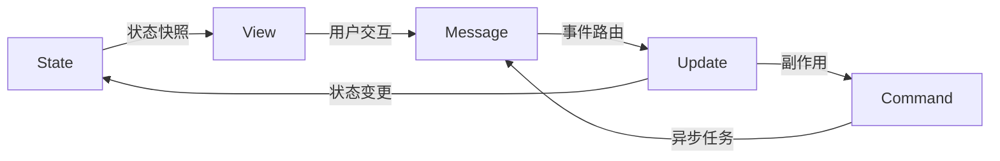
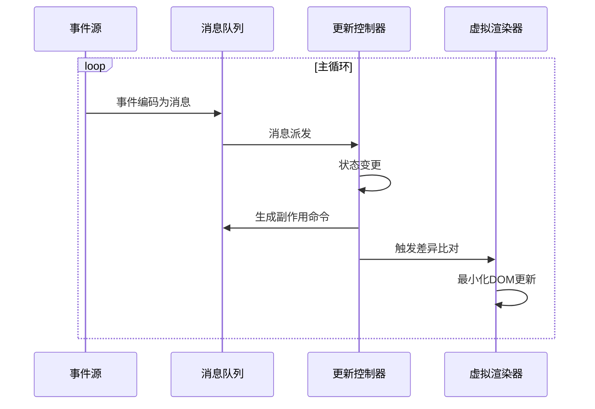
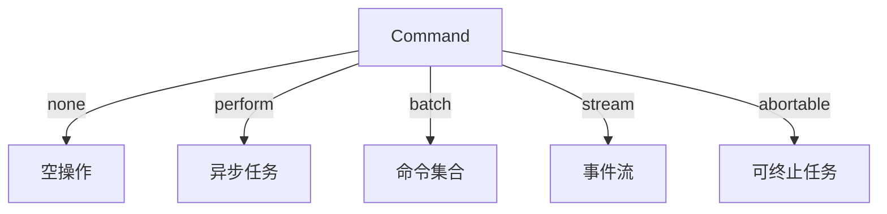
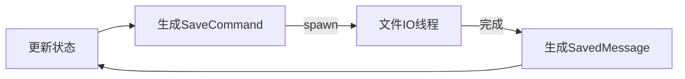
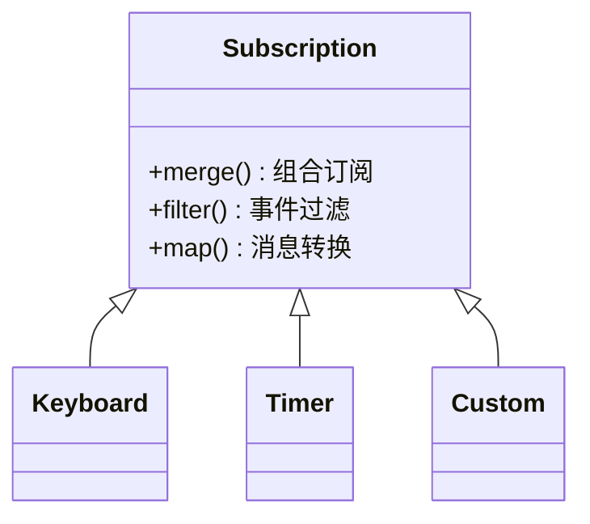
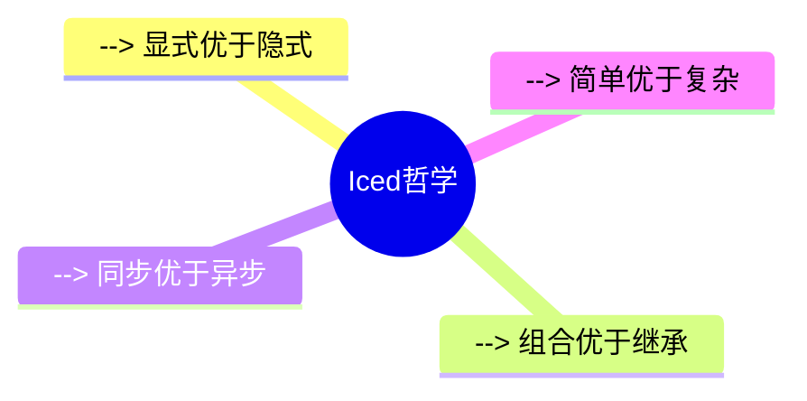

import { YoutubePlayer } from "../components/YoutubePlayer.tsx";

> 参考入门视频：
>
> <YoutubePlayer videoId="gcBJ7cPSALo" />


## 目录

1. [架构总览：消息驱动的响应式系统](#架构总览)
2. [状态管理的基本单元与数据流](#状态管理)
3. [渲染循环与事件处理机制](#渲染循环)
4. [异步任务处理与并发模型](#异步模型)
5. [组件间通信与扩展机制](#组件通信)
6. [框架设计启示录](#设计启示)

<a id="架构总览"></a>

## 1. 架构总览：消息驱动的响应式系统

Iced 的核心架构遵循经典的 Elm 模式，其运行时模型可抽象为三个核心要素：
• **状态容器**：承载当前应用数据的不可变结构体
• **消息管道**：用户交互与系统事件的中继处理器
• **渲染引擎**：基于状态变更的视图同步器



这种架构实现了严格的单向数据流，使得状态变更具有可预测性。特别值得注意的是，视图层不直接修改状态，而是通过消息管道间接触发状态变更。

<a id="状态管理"></a>

## 2. 状态管理的基本单元与数据流

状态容器的设计体现了最小化原则：
• 纯数据结构体，无生命周期绑定
• 每次更新生成新状态实例（非强制）
• 变更触发条件严格受控于消息类型

**Q: 为何不采用自动依赖追踪？**

通过强制显式声明消息处理路径，实现了：

1. 状态变更路径显式化
2. 调试溯源能力增强
3. 渲染优化边界清晰化

<a id="渲染循环"></a>

## 3. 渲染循环与事件处理机制

核心处理流程包含四个阶段：



**Q: 视图更新是立即生效的吗？**

更新流程遵循"批处理优先"原则：

1. 同步操作立即更新状态并触发渲染
2. 异步操作将任务移交运行时
3. 视图层在每帧渲染前同步最新状态

<a id="异步模型"></a>

## 4. 异步任务处理与并发模型

命令(Command)系统实现了副作用隔离机制：



**Q: 长时间异步任务会阻塞界面吗？**

通过任务调度器的分级策略：
• I/O 密集型：移交线程池
• UI 密集型：主线程优先
• 定时任务：时间切片处理

典型处理流程：



<a id="组件通信"></a>

## 5. 组件间通信与扩展机制

事件订阅系统采用观察者模式变体：



**Q: 如何处理多事件源订阅？**

通过订阅合成器实现：

```rust
Subscription::batch([
    keyboard::on_key_press(),
    mouse::on_click(),
    custom::on_event()
])
```

<a id="设计启示"></a>

## 6. 框架设计启示录

从架构决策中提取的通用设计原则：

1. **消息优先架构**
   • 所有交互抽象为消息对象
   • 统一的事件处理管道
   • 天然支持时间旅行调试

2. **副作用沙箱化**
   • 命令系统隔离 IO 操作
   • 异步任务生命周期可控
   • 纯函数式状态更新

3. **响应式渲染优化**
   • 基于消息的变更检测
   • 虚拟 DOM 差异比对
   • 帧率自适应的渲染调度

4. **可扩展接口设计**
   • 组件即消息处理器
   • 样式系统与逻辑解耦
   • 平台抽象层设计



这种设计选择带来的工程优势：
• 新人快速理解架构轮廓
• 调试时问题定位效率提升
• 跨平台一致性保障
• 长期维护成本优化

通过解构 Iced 的实现细节，我们看到的不仅是某个 GUI 框架的特质，更是一套经过验证的架构模式在具体领域的成功实践。这种模式的核心价值在于，它用约束创造自由，通过限制状态修改路径来获得系统级的可维护性提升。
