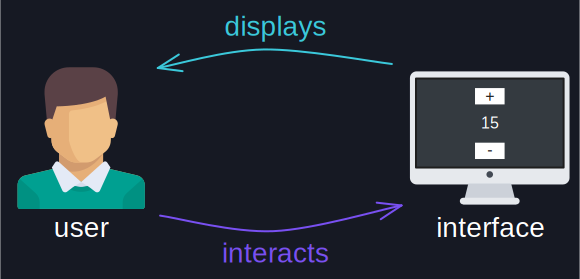
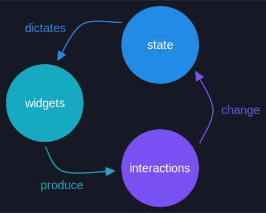
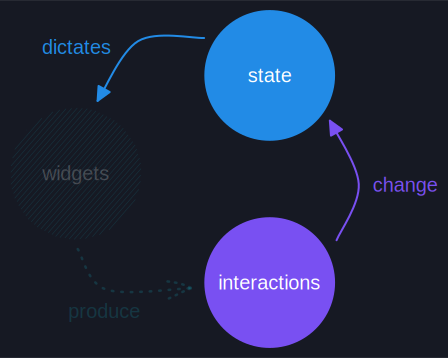
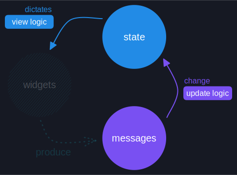

# Architecture

Let's start from the basics! You are probably very familiar with graphical user interfaces already.
You can find them on your phone, computer, and most interactive electronic devices. In fact, you are
most likely reading this book using one!

At their essence, graphical user interfaces are applications that **display** some information graphically
to a user. This user can then choose to **interact** with the application—normally using some kind of device;
like a keyboard, mouse, or touchscreen.

  

The user interactions may cause the application to update and display new information as a result, which in turn
may cause further user interactions, which in turn cause further updates... And so on. This quick feedback loop
is what causes the feeling of _interactivity_.

> Note: In this book, we will refer to graphical user interfaces as **GUIs**, **UIs**, **user interfaces**, or simply
> **interfaces**. Technically, not all interfaces are graphical nor user-oriented; but, given the context of this
> book, we will use all of these terms interchangeably.

## Dissecting an Interface

Since we are interested in creating user interfaces, let's take a closer look at them. We will start with a very
simple one: the classical counter interface. What is it made of?

  

As we can clearly see, this interface has three visibly distinct elements: two buttons with a number in between.
We refer to these visibly distinct elements of a user interface as **widgets** or **elements**.

Some **widgets** may be interactive, like a button. In the counter interface, the buttons can be used to trigger
certain **interactions**. Specifically, the button at the top can be used to increment the counter value, while the
button at the bottom can be used to decrement it.

We can also say that user interfaces are _stateful_—there is some **state** that persists between interactions.
The counter interface displays a number representing the counter value. The number displayed will change depending on
the amount of times we press the buttons. Pressing the increment button once will result in a different displayed value
compared to pressing it twice.

  

## The GUI Trinity

Our quick dissection has successfully identified three foundational ideas in a user interface:

- **Widgets** — the distinct visual elements of an interface.
- **Interactions** — the actions that may be triggered by some widgets.
- **State** — the underlying condition or information of an interface.

These ideas are connected to each other, forming another feedback loop!

**Widgets** produce **interactions** when a user interacts with them. These **interactions** then change the **state**
of the interface. The changed **state** propagates and dictates the new **widgets** that must be displayed. These new
**widgets** may then produce new **interactions**, which can change the **state** again... And so on.

  

These ideas and their connections make up the fundamental architecture of a user interface. Therefore, creating a user
interface must inevitably consist in defining these **widgets**, **interactions**, and **state**; as well as the connections
between them.

## Different Ideas, Different Nature

The three foundational ideas of an interface differ quite a bit when it comes to reusability.

The state and the interactions of an interface are very specific to the application and its purpose. If I tell you that
I have an interface with a numeric value and increment and decrement interactions, you will very easily
guess I am talking about a counter interface.

However, if I tell you I have an interface with two buttons and a number... It's quite trickier for you to guess the kind
of interface I am talking about. It could be anything!

This is because widgets are generally very generic and, therefore, more reusable. Most interfaces display a combination of
familiar widgets—like buttons and numbers. In fact, users expect familiar widgets to always behave a certain way. If they
don't behave properly, the interface will be unintuitive and have poor [user experience].

While widgets are generally very reusable; the specific widget configuration dictated by the application state and its
interactions is very application-specific. A button is generic; but a button that has a "+" label and causes a value
increment when pressed is very specific.

All of this means that, when we are creating a specific user interface, we don't want to focus on implementing every
familiar widget and its behavior. Instead, we want to leverage widgets as reusable building blocks—independent of our
application and provided by some library—while placing our focus on the application-specific parts of the fundamental
architecture: state, interactions, how the interactions change the state, and how the state dictates the widgets.

  

[user experience]: https://en.wikipedia.org/wiki/User_experience

## The Elm Architecture

It turns out that the four application-specific parts of the architecture of an interface are also the four foundational
ideas of [The Elm Architecture].

> The Elm Architecture is a pattern for architecting interactive programs that emerges naturally in [Elm], a delightful
> purely functional programming language for reliable web applications.
>
> Patterns and ideas that emerge in purely functional programming languages tend to work very well in Rust
> because they leverage immutability and [referential transparency]—both very desirable properties that not only
> make code easy to reason about, but also play nicely with the borrow checker.
>
> Furthermore, The Elm Architecture not only emerges naturally in Elm, but also when simply dissecting user
> interfaces and formalizing their inner workings; like we just did in this chapter.

The Elm Architecture uses a different—if not more precise—nomenclature for its fundamental parts:

- **Model** — the state of the application.
- **Messages** — the interactions of the application.
- **Update logic** — how the messages change the state.
- **View logic** — how the state dictates the widgets.

These are different names, but they point to the same exact fundamental ideas we have already discovered and,
therefore, can be used interchangeably.

  

> Note: In iced, the names **state** and **messages** are used more often than **model** and
> **interactions**, respectively.

[The Elm Architecture]: https://guide.elm-lang.org/architecture/
[Elm]: https://elm-lang.org/
[referential transparency]: https://en.wikipedia.org/wiki/Referential_transparency
