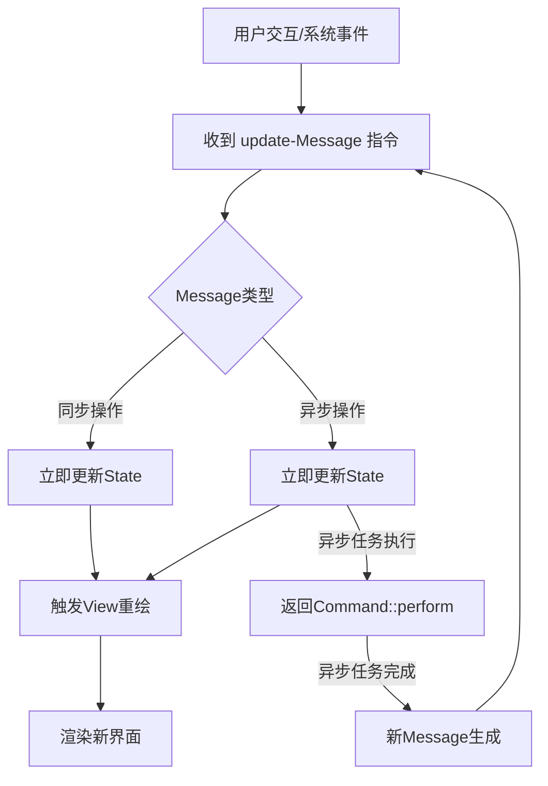

这里介绍了如何使用 iced 开发一个简单的文本编辑器，提供了基本的 新建、打开、保存 这几个基础文件功能。

首先结构上，它提供了一个 Application 级别的结构体。

这个结构体上通过挂在一个 `view`函数，来返回一个视图绘制的 Tree 对象。它提供了基本的 flex 布局能力。

对于数据管理，没有什么特别的，就是一个普通的结构体而已。

它的渲染流程是这样的，通过挂在一个 `update`函数来处理所有的事件。然后所有的 button 等界面交互，可以通过 `button("open").on_press(Message:Open)`来传递消息，然后通过 `match msg`来处理消息。

这个 `update` 函数需要返回一个 Commond 对象，一般是 `Command::none()`，或者 `Command::perform(future, mapper)`可以用来等待异步结束，然后返回下一个 Message 对象。(我好奇的是，这个异步过程中，为了状态的管理，是否意味着这部分视图不可以再执行接下来的 `update`请求，需要等待当前的异步任务处理完了后，才能处理其它的。所以这部分视图是阻塞的。我还好奇，这部分视图的阻塞，是否会影响整个应用程序其它部分 `update` 的处理，还是说它们都是独立的，可以独立执行。我还好奇，Command::perform 这种异步操作，居然没有先进入一个“处理中”的状态？那么组件之间，能否识别对方组件的状态？还是说组件通讯也是通过 message，那么就相对走 message 的队列，也就应该是安全的。只不过没有“处理中”的状态渲染，我总感觉遇到一些长时间任务，体验对用户来说不友好)。

关于 update 函数，我猜测其底层原理是，执行完 update 后，它会再执行一次 view，以确保视图能渲染最新的内容：

（我好奇，Command除了none、perform，还有其它什么?我在官方的runtime/src/task.rs文件里找到一些：

none、done、perform、run、sip、batch、map、then、chain、collect、discard、abortable、future、stream，但我需要一些总结和讲解，因为其它框架的架构师在看到这些的时候，也许能有一些启发）

最终是关于键盘的绑定，iced 是通过一个 `subscription`函数来实现的，它返回一个 `Subscription<T>`对象。

比如 `keyboard::on_key_press(on_fun)`。（我好奇的是，如果有多种绑定，那么应该如何返回？是否 Subscription 对象可以进行合并？）
