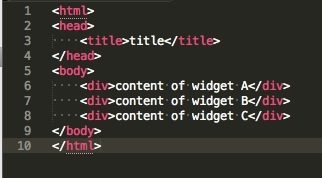

> **注：** 本文章的文字内容来自鬼懿群 19:08 2014/2/11 的内容，并非访谈形式。内容有所删减。
> 主要人物 @漂流瓶

首先，你要相信，有办法做到同一个页面，根据不同的 url 或者 ua 可以把它输出为 json 结构的数据或者传统页面
以 php 为例
稍等，我简单 coding 一下

这是一个传统 html 页面
有三个小部件
A、B、C
现在，我们希望用组件化的方式来维护他们，代码可能变成了

假设，这个页面的 url 是 /index
好了，我们是否能开发一种框架，使得：
1 当一个普通的浏览器用户或者网络爬虫用户访问 /index 的时候，输出一个传统的 html 内容
2 当一个 js 发起的 ajax 请求，比如是 /index?widgets=A,B 的时候，页面返回一个 json 数据，内容是 A、B 两个小部件的 html 代码？
如果能开发一个框架，满足上述两个条件，那么，你可以做到：
1 用户第一次访问页面，网络爬虫访问页面，都得到一个传统的 html 代码
2 当我们需要更新页面中的一个小组件的时候，可以用 ajax 获取这个页面中的局部内容进行更新，从而得到一站式应用
我们也开发了一个工具内置的调试服务器，支持 php、jsp、nodejs 的后端服务。我们只是构造一个能运行模板的 mock 环境，api 和后端一致，但数据来源都是模拟数据
前端工程师写代码的时候感觉不到自己在写一站式应用
解决 A 问题，不一定非要 B 方案
同步更新后端工程师的代码，就可能是一个 X-Y 问题

> 那你说一下怎么让他们感觉不到服务器端的存在，也不需要他们为这块做任何附加的工作

你的目标是运行他们的模板代码，而不是运行整个网站的代码
运行模板代码会简单很多，而且可以保证在本地运行起来的模板代码，在真实的环境中也是一样的运行效果

> 你们的服务器是什么样的，是不是一个 bat 脚本，开发人员只要双击一下，服务器就建好了，它只处理渲染模块的事件？
> 那 mock 的数据是不是在一个 data 目录里，用 txt 来保存，能区别不同的参数

使用方式类似，但还有些东西要做，这里我们曾经走过很多弯路，或许你觉得有问题，但可以作为一个借鉴
可能是你曾经放弃的一个方向，但我们坚持了过来

> 我觉得没有什么问题
> 只是我在想一个连这个假后端都不用的方案

听我说完吧，我知道这是你曾经放弃的方向，也是我们曾经想要放弃的，但是走来之后，大家用的都很爽，我们为百度 40 多个产品线 300 多个工程师提供的技术，不会很不靠谱吧
首先，从本地服务器开发说起。我们不是用的现成的东西，因为很重，安装麻烦。我们要求工程师不安装的，并且同时能支持 php、jsp 和 nodejs 的后端服务

> 漂流瓶，相信我，我没有不同意你的看法
> 你说的方案，我考虑过，也在之前的公司推广过
> 也的确能行得通

相信我，你听我说完，可能会是一个不一样的结果。因为这是一个猜得到开头，可能猜不到结局的方案啊
虽然开头有些前篇一律
我们光在本地服务器开发上就花费了很多投入
node、jre 我们认为已存在了的没有考虑，前端工程师都有的环境。php-cgi 我们本来想集成到 fis 里，但是嫌大就放弃了，这个环境有一键安装的东西
1 我们用 jetty 开发了一个 1.8M 的服务器，这个服务器支持 java、jsp，
2 我们开发了一个 npm 包，使用了 1 中的服务器，加上 nodejs 服务器
这样，我们的服务器就支持 java、jsp、nodejs 了。接下来，jetty 有 factcgi 链接功能，我们要求用户提供 php-cgi 环境，如果没有，我们也有 allinone 的脚本
我承认，对于 php 开发的用户来说，安装 php-cgi 要花一些时间，不过对于业绩所有前端开发工程师来说，一个包含了 java\jsp\nodejs\php 的服务器，而且只有 1.8m，应该比较够用了
3 我们把这个 server 和工具放在了一起，成为工具的一部分。这样，每个新人用 npm 安装工具的时候，就有了这个 server，分发的能力基本可以接受
server 只是第一步，接下来要解决的是本地模板运行、数据模拟、url 模拟、ajax 响应的问题。我觉得这部分可能是你说的比较不能统一的。也是我想说的那个“没猜到的结局”部分
有了 server，我们可以运行 jsp、freemarker、velocity、smarty 等模板。以 smarty 为例（它最简单），它需要的后端接口有哪些呢？
1 display：渲染模板
2 assign：注入数据
3 业务相关的数据、处理接口
其中，display、assign 是模板引擎提供的 api，业务数据处理接口才是我们需要 mock 的，这里还有几个问题：
1 不同产品线有不同的 api，我们不能写死，而是应该给 server 一个可配置的能力，使得产品线提供一个文件，就能简单 mock 这些 api 的处理
2 url 不同的产品线也有很多不同，这里我们要有一种办法提供 url 的控制
总之，工具、框架、本地环境各自都是一块可以说很多的东西
把这些工具、框架、流程打通也很重要，东拼西凑的还是挺难弄的，工具和框架不配套，或者框架和规范不配套的事情非常纠结

> 我回头再一看，我感觉你好像有点本末倒了
> 前端开发人员来说，没有 php,java,node 的区别
> 他们要处理的只有 html 之类的
> 最多也只是模板语法的区别
> 所以你大可不用准备三四种语言的服务器

我说的是构造环境，这些真正的开发人员不需要知道

> 所以为什么要把 php,jsp,node 集为一体呢

最终用户不知道有这些细节
为了我们的工具可以面向更多的团队

> 做一个这个的服务器呢
> 前端人员，只要知道模板语法呀

是啊

我没有破坏这个前提，我们的目标是一致的，开发体验也是要极致追求的
我们之前用 java 的 php 模拟的一个类来处理 php，结果有很多坑，前端工程师更不可能知道了
jetty，有一个功能，就是可以用 fastcgi 连接 php-cgi 进程，这里不赘述了，反正就是能跑一个真实的 php 环境
接着说一下 url 模拟的问题，这部分是工程师关心的
我还是不扯太多了，我直接说结果吧
工程师开发模板，全都是前端代码
我们的 server，有一个功能，就是下载一个文件包，这个包里来自一个生态环境，这里面就是对某个产品线后端 api 的 mock
前端工程师开发的时候，开发体验是这样的：
1 启动本地服务器：
fis server start
2 如果是第一次启动，给 server 安装一个小小的模拟 url 控制的路由器：
fis server install xxx-server-mock
3 开发自己的代码，把结果投送到本地服务器的浏览目中
这个 xxx-server-mock，就是几个简单的 php 文件，提供了模板所需的 api，不同的产品线可能不同，但都通过 server install xxx 来获取就行
不同的团队可以有不同的 mock 包，但代码都简单的。
我们的 server 有两种启动模式，一种是 no-rewrite，就是传统的 server。另一种是 rewrite，可以把所有请求交给 mock 包里的一个 index.php 处理，它来实现 url 的模拟
这样，真正的工程师不知道我们在 mock 包里写了什么，他也不需要知道。他只知道第一次使用工具，要执行以下 server install xxx-server-mock
这个时候，这个服务器就是为其量身定做的服务器了

> 说的是 FIS 这个工具？

恩，fis 是一个帮助前端架构师设计开发规范、开发框架，开发流程，并最终把他们串联起来的一个系统
我们希望每个团队的架构师根据自己团队的项目特点选择合适的框架、定制合理的开发规范、目录结构，并且融入到公司已有的开发流程中
这四个东西，需要一个工具来连接起来，使得开发形成一个比较流畅的体验
