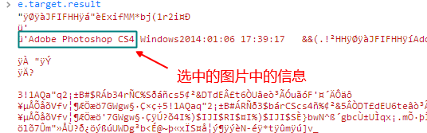

> 文件类的提供使得 JS 能够操作所能获取的各种文件的操作提供支持。
> 比如 Ajax 获取的文件，input[type='file']选中的文件，或者是用户自己生成的文件等等……。

推荐阅读：[理解 DOMString、Document、FormData、Blob、File、ArrayBuffer 数据类型——张鑫旭](http://www.zhangxinxu.com/wordpress/2013/10/understand-domstring-document-formdata-blob-file-arraybuffer/)

本文针对文件读取以及 Blob 对象的简单使用做一个事例。

## 文件读取

- readAsText：以文字方式读文档內容，放到 result 属性，默认编码 UTF-8。
- readAsDataURL：读取到的內容会编码成 data URL，放到 result 属性。
- readAsArrayBuffer：result 属性会包含一個 ArrayBuffer 物件。
- readAsBinaryString：以二进制方式读文档內容，放到 result 属性。

上面所说的 result 属性，指的是[`FileReader.result`](https://developer.mozilla.org/en-US/docs/Web/API/FileReader.result)。比如下面代码：

```js
var reader = new FileReader();
reader.onload = function (e) {
  e.target === reader;

  reader.result;
};
```

javaScript 关于异步 API 其实都差不多一个样子。因为本身就是**事件机制**。所以回调中的第一个属性也是 Event 对象。这边属于[`ProgressEvent`](https://developer.mozilla.org/en-US/docs/Web/API/ProgressEvent)。而 e.target，指的就是触发发起者，也就是前面定义的 reader。

如果你要读取一个文本文件。比如说 XML、js、css 文件等等。直接用`readAsText`，它会把返回的数据用指定编码或者默认编码进行解析，`reader.result`等同于 Ajax 返回对象的`responseText`属性。

readAsDataURL 的话，就是帮你把二进制转化成`base64`的格式。为此可以`reader.result`当成图片的 src 直接用、CSS 的 url 属性用等等。

readAsArrayBuffer 返回的[ArrayBuffer](https://developer.mozilla.org/en-US/docs/Web/API/ArrayBuffer)其实也就是最原始的二进制数据。在所给的链接中的文档说介绍的一样，系统并没有提供什么方法来操作二进制文件，连遍历的方法都没有给。
因为是底层的产物，可能它所能做的除了存储数据，就是告诉你数据大小了（比如[base64DecToArr 的使用](https://developer.mozilla.org/en-US/docs/Web/JavaScript/Base64_encoding_and_decoding#Appendix.3A_Decode_a_Base64_string_to_Uint8Array_or_ArrayBuffer)），当然，它最多的用途就是用来做其它 API 的参数使用，比如 Ajax 异步上传文件。

而 readAsBinaryString，则将 ArrayBuffer 转化为原生的 String 类型，为此能够操纵文件的具体内容。而不再只是孤零零地盯着 ArrayBuffer 什么也干不了。为此你可以用来做文件的安全性检测，检查文件类型时候正确等等等等，比如说我可以查找一个图片的信息，如果有 PS 处理过的痕迹，可以很清晰地看到想关信息：



## Blob 对象

在文章最前面的**推荐阅读**中就已经很清晰地介绍了 Blob 对象，在我眼中，它就是一个文件。
为此我得到了**创建一个文件的权限**。
比如在 Web Worker 中，它需要一个 js 文件地址，而你不想真的用一个文件去记录这些代码，兴许太麻烦了，毕竟不利于压缩什么的各种借口。这时你就可以用 Blob 来实现。（注意：以前你可能看过 BlobBuilder 之类的 API，但已经被废弃，请用标准的 API，类似的 shim 也是有的）

下面就用一个简单的**综合应用**来展示 Blob 的使用

## 综合应用

这代码是来自我的一个项目，因为要用到**字体的上传与预览**，为此在选中字体文件后需要做一个预览字体一样的功能，就像预览图片一样。

但是不同的是，字体的预览需要动态生成样式表。

所以你可以使用 Blob 来生成一个新的 css 文件，而后通过`<link>`标签引入使用。

这边介绍直接在 head 中插入 style 标签的方法，思路一样：

```js
//file对象来自input的change事件中event.target.files的元素

var fontInfo = file.name.split(".");
var postfix = fontInfo.pop().toLowerCase();
var fontName = fontInfo.pop() + "-" + postfix;
// 这边支持两种字体格式 ttf 和 woff
if (postfix === "ttf" || postfix === "woff") {
  var reader = new FileReader();
  reader.onload = function (e) {
    var blob = new Blob([e.target.result], {
      // type: "application/x-font-" + postfix
      // type: "font/" + postfix
      type: "application/octet-stream",
    });
    var url = URL.createObjectURL(blob);
    var tempStyleElement = document.createElement("style"); //w3c
    tempStyleElement.setAttribute("type", "text/css");
    document.getElementsByTagName("head")[0].appendChild(tempStyleElement);
    //样式表内容
    var formatType = {
      ttf: "truetype",
      woff: "woff",
    };
    var styleText =
      "\
@font-face { \
    font-family:" +
      JSON.stringify(fontName) +
      "; \
    src: url(" +
      url +
      ") format('" +
      formatType[postfix] +
      "'); \
    font-weight: normal; \
    font-style: normal; \
} \
            ";
    tempStyleElement.textContent = styleText;
    vm.set("content.layerAttr.fontFamily", fontName);
    vm.get("$PRIVATE.reDrawLayer")();
  };
  reader.readAsBinaryString(file);
} else {
  console.warn("只允许字体文件！");
}
```

> 补注：reader.readAsDataURL 所生成的 base64 格式是`src:url`所能直接支持的。但是如果字体文件过大，styleText 也会非常庞大，内存消耗不说，`tempStyleElement.textContent = styleText;`这段代码就要卡上一两秒。所以需要用 Blob 生成一个 blog-url 来替代庞大的文件数据。
