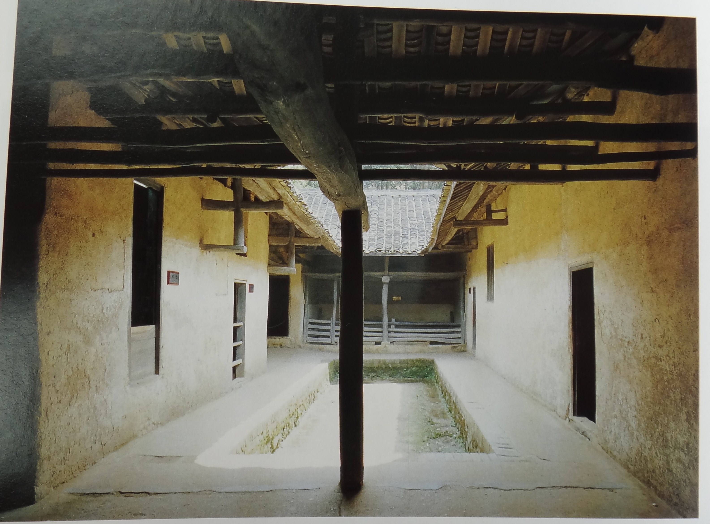

> 课程视频来自：**[edX](https://courses.edx.org/courses/PekingX/02030330X/3T2013/progress)**
> 导师：**PekingX**
> 课程号：**02030330x**

---

# 视频

> 请直接右键复制链接在独立的窗口中打开，否则视频来源保护会导致 403 权限问题

## 民俗学概说

- [民俗与文化](http://video.study.163.com/edu-video/nos/mp4/2013/09/06/285134_shd.mp4)
- [民与俗](http://video.study.163.com/edu-video/nos/mp4/2013/09/06/284157_shd.mp4)
- [民俗学的诞生](http://video.study.163.com/edu-video/nos/mp4/2013/09/06/285142_shd.mp4)
- [民俗的特点](http://video.study.163.com/edu-video/nos/mp4/2013/09/06/284163_shd.mp4)
- [民俗的产生与传播](http://video.study.163.com/edu-video/nos/mp4/2013/09/06/285143_shd.mp4)
- [民俗的功能](http://video.study.163.com/edu-video/nos/mp4/2013/09/06/284164_shd.mp4)

## 神话

- [什么是神话](http://video.study.163.com/edu-video/nos/mp4/2013/09/06/285144_shd.mp4)
- [神话的特点](http://video.study.163.com/edu-video/nos/mp4/2013/09/06/284165_shd.mp4)
- [神话的分类](http://video.study.163.com/edu-video/nos/mp4/2013/09/06/284166_shd.mp4)
- [神话的起源](http://video.study.163.com/edu-video/nos/mp4/2013/09/06/285145_shd.mp4)
- [《民间文学母题索引》](http://video.study.163.com/edu-video/nos/mp4/2013/09/06/284167_shd.mp4)
- [神话研究](http://video.study.163.com/edu-video/nos/mp4/2013/09/06/285146_shd.mp4)

## 民间故事与传说

- [故事与传说的定义](http://video.study.163.com/edu-video/nos/mp4/2013/09/06/284168_shd.mp4)
- [故事与传说的特点](http://video.study.163.com/edu-video/nos/mp4/2013/09/06/285147_shd.mp4)
- [故事与传说的分类](http://video.study.163.com/edu-video/nos/mp4/2013/09/06/284169_shd.mp4)
- [故事与传说研究](http://video.study.163.com/edu-video/nos/mp4/2013/09/06/284170_shd.mp4)

## 民间歌谣

- [歌谣概说](http://video.study.163.com/edu-video/nos/mp4/2013/10/17/299038_hd.mp4)
- [民歌](http://video.study.163.com/edu-video/nos/mp4/2013/10/19/299146_hd.mp4)
- [民谣](http://video.study.163.com/edu-video/nos/mp4/2013/10/17/299042_hd.mp4)
- [故事歌](http://video.study.163.com/edu-video/nos/mp4/2013/10/17/299039_hd.mp4)
- [歌谣研究](http://video.study.163.com/edu-video/nos/mp4/2013/10/17/299040_hd.mp4)

## 民间建筑

- [民间建筑及其起源](http://video.study.163.com/edu-video/nos/mp4/2013/10/27/299312_hd.mp4)
- [民间建筑的价值](http://video.study.163.com/edu-video/nos/mp4/2013/10/27/299313_hd.mp4)
- [中国民居的类型](http://video.study.163.com/edu-video/nos/mp4/2013/10/27/300266_hd.mp4)
- [中国民居的特点](http://video.study.163.com/edu-video/nos/mp4/2013/10/27/299311_hd.mp4)
- [民间建筑研究](http://video.study.163.com/edu-video/nos/mp4/2013/10/27/299310_hd.mp4)
- 相关图片
  - 
  - 
  - 
  - 
  - 

## 民间服饰

- [民间服饰概说](http://video.study.163.com/edu-video/nos/mp4/2013/11/02/299503_hd.mp4)
- [服饰的起源](http://video.study.163.com/edu-video/nos/mp4/2013/11/02/299501_hd.mp4)
- [服饰的功能](http://video.study.163.com/edu-video/nos/mp4/2013/11/02/300555_hd.mp4)
- [民间服饰类型](http://video.study.163.com/edu-video/nos/mp4/2013/11/02/300548_hd.mp4)
- [民间服饰研究](http://video.study.163.com/edu-video/nos/mp4/2013/11/02/300556_hd.mp4)

## 民间美术

- [民间美术概说](http://video.study.163.com/edu-video/nos/mp4/2013/11/09/299888_hd.mp4)
- [民间美术的起源](http://video.study.163.com/edu-video/nos/mp4/2013/11/09/299890_hd.mp4)
- [民间美术的模式](http://video.study.163.com/edu-video/nos/mp4/2013/11/09/299891_hd.mp4)
- [民间美术的主题](http://video.study.163.com/edu-video/nos/mp4/2013/11/09/300911_hd.mp4)
- [民间美术的传承](http://video.study.163.com/edu-video/nos/mp4/2013/11/09/300912_hd.mp4)
- [民间美术研究](http://video.study.163.com/edu-video/nos/mp4/2013/11/09/299889_hd.mp4)

## 民间节日

- [民间节日概说](http://video.study.163.com/edu-video/nos/mp4/2013/11/17/303275_hd.mp4)
- [节日的起源](http://video.study.163.com/edu-video/nos/mp4/2013/11/17/303276_hd.mp4)
- [民间节日的结构](http://video.study.163.com/edu-video/nos/mp4/2013/11/17/303277_hd.mp4)
- [中国传统节日](http://video.study.163.com/edu-video/nos/mp4/2013/11/17/303280_hd.mp4)
- [女性的节日](http://video.study.163.com/edu-video/nos/mp4/2013/11/17/303279_hd.mp4)
- [节日研究](http://video.study.163.com/edu-video/nos/mp4/2013/11/17/303278_hd.mp4)

## 民间游戏

- [民间游戏及其特点](http://video.study.163.com/edu-video/nos/mp4/2013/11/23/303520_hd.mp4)
- [民间游戏的类型](http://video.study.163.com/edu-video/nos/mp4/2013/11/23/303522_hd.mp4)
- [民间游戏研究](http://video.study.163.com/edu-video/nos/mp4/2013/11/23/303519_hd.mp4)
- [儿童游戏](http://video.study.163.com/edu-video/nos/mp4/2013/11/23/303521_hd.mp4)
- [个案研究：捉迷藏](http://video.study.163.com/edu-video/nos/mp4/2013/11/23/303523_hd.mp4)

## 人生礼仪

- [人生礼仪概说](http://video.study.163.com/edu-video/nos/mp4/2013/12/01/304120_hd.mp4)
- [人生礼仪的基本原理](http://video.study.163.com/edu-video/nos/mp4/2013/12/01/305116_hd.mp4)
- [人生礼仪的功能](http://video.study.163.com/edu-video/nos/mp4/2013/12/01/305118_hd.mp4)
- [人生礼仪的结构](http://video.study.163.com/edu-video/nos/mp4/2013/12/01/305117_hd.mp4)
- [人生礼仪研究](http://video.study.163.com/edu-video/nos/mp4/2013/12/01/305115_hd.mp4)
- [个案研究：婚礼](http://video.study.163.com/edu-video/nos/mp4/2013/12/01/305119_hd.mp4)

## 田野调查

- [什么是田野调查](http://video.study.163.com/edu-video/nos/mp4/2013/12/08/306174_hd.mp4)
- [田野调查的发现及方法的确立](http://video.study.163.com/edu-video/nos/mp4/2013/12/08/306173_hd.mp4)
- [田野调查的内容](http://video.study.163.com/edu-video/nos/mp4/2013/12/08/306175_hd.mp4)
- [个案研究：山西洪洞“接姑姑迎娘娘”](http://video.study.163.com/edu-video/nos/mp4/2013/12/19/321156_hd.mp4)
- [个案研究：妙峰山香会](http://video.study.163.com/edu-video/nos/mp4/2013/12/28/330095_hd.mp4)

---

# 源网址内容

```html
<div class="chapters">
    <section>
        <h2>民俗学概说</h2>

        <div class="sections">
            <div>


                <h3><a href="https://courses.edx.org/courses/PekingX/02030330X/3T2013/courseware/84f53f6e12c44345896c14af69e1cbb6/adc82bfe78c44e5a92f4a33b576b4f43/">
                民俗与文化
                </a>
                </h3>
            </div>
            <div>


                <h3><a href="https://courses.edx.org/courses/PekingX/02030330X/3T2013/courseware/84f53f6e12c44345896c14af69e1cbb6/ecb9253cf7f74891aedcff066c3af9a0/">
                民与俗
                </a>
                </h3>
            </div>
            <div>


                <h3><a href="https://courses.edx.org/courses/PekingX/02030330X/3T2013/courseware/84f53f6e12c44345896c14af69e1cbb6/64e4840e8dfc4be4bceead6171921d54/">
                民俗学的诞生
                </a>
                </h3>
            </div>
            <div>


                <h3><a href="https://courses.edx.org/courses/PekingX/02030330X/3T2013/courseware/84f53f6e12c44345896c14af69e1cbb6/108a20bfd11648dcb7cc10cb5bd32403/">
                民俗的特点
                </a>
                </h3>
            </div>
            <div>


                <h3><a href="https://courses.edx.org/courses/PekingX/02030330X/3T2013/courseware/84f53f6e12c44345896c14af69e1cbb6/9dcffc7ca8c64a02b57a3f9cc261d917/">
                民俗的产生与传播
                </a>
                </h3>
            </div>
            <div>


                <h3><a href="https://courses.edx.org/courses/PekingX/02030330X/3T2013/courseware/84f53f6e12c44345896c14af69e1cbb6/ab0af5d12514424596aa0dfc3e2a3766/">
                民俗的功能
                </a>
                </h3>
            </div>
            <div>


                <h3><a href="https://courses.edx.org/courses/PekingX/02030330X/3T2013/courseware/84f53f6e12c44345896c14af69e1cbb6/27110b8250354a3bbc49b67edc98ca3d/">
                在线答疑
                </a>
                </h3>
            </div>
        </div>
        <!--End sections-->
    </section>
    <!--End chapter-->
    <section>
        <h2>神话</h2>

        <div class="sections">
            <div>


                <h3><a href="https://courses.edx.org/courses/PekingX/02030330X/3T2013/courseware/9daa0f05c384441dbada5503947e1357/fe49242418824645b1a60ed9e53f5dad/">
                什么是神话
                </a>
                </h3>
            </div>
            <div>


                <h3><a href="https://courses.edx.org/courses/PekingX/02030330X/3T2013/courseware/9daa0f05c384441dbada5503947e1357/9a0378c8e80c4a509bf2ad50f3df4119/">
                神话的特点
                </a>
                </h3>
            </div>
            <div>


                <h3><a href="https://courses.edx.org/courses/PekingX/02030330X/3T2013/courseware/9daa0f05c384441dbada5503947e1357/7c242e89d44c45f3a68cbefd7b71cb8d/">
                神话的分类
                </a>
                </h3>
            </div>
            <div>


                <h3><a href="https://courses.edx.org/courses/PekingX/02030330X/3T2013/courseware/9daa0f05c384441dbada5503947e1357/447c5888e4e4429db110e4acf4206526/">
                神话的起源
                </a>
                </h3>
            </div>
            <div>


                <h3><a href="https://courses.edx.org/courses/PekingX/02030330X/3T2013/courseware/9daa0f05c384441dbada5503947e1357/1554980c342e48b4862bf5d04e40fb39/">
                《民间文学母题索引》
                </a>
                </h3>
            </div>
            <div>


                <h3><a href="https://courses.edx.org/courses/PekingX/02030330X/3T2013/courseware/9daa0f05c384441dbada5503947e1357/85bd766fadf3482e8a29b22b90e4902c/">
                神话研究
                </a>
                </h3>
            </div>
            <div>


                <h3><a href="https://courses.edx.org/courses/PekingX/02030330X/3T2013/courseware/9daa0f05c384441dbada5503947e1357/bbc3f99289a4430bac3b0e69b23a7d11/">
                在线答疑
                </a>
                </h3>
            </div>
        </div>
        <!--End sections-->
    </section>
    <!--End chapter-->
    <section>
        <h2>民间故事与传说</h2>

        <div class="sections">
            <div>


                <h3><a href="https://courses.edx.org/courses/PekingX/02030330X/3T2013/courseware/17748f06a14a4839a1b05bcccd2155cc/1ed26497f2344277890e20a4cbb524c5/">
                故事与传说的定义
                </a>
                </h3>
            </div>
            <div>


                <h3><a href="https://courses.edx.org/courses/PekingX/02030330X/3T2013/courseware/17748f06a14a4839a1b05bcccd2155cc/2af03745a3414021936dbe0c36d4dc5e/">
                故事与传说的特点
                </a>
                </h3>
            </div>
            <div>


                <h3><a href="https://courses.edx.org/courses/PekingX/02030330X/3T2013/courseware/17748f06a14a4839a1b05bcccd2155cc/bcb243fd881c4369983da8d6c15b1ef2/">
                故事与传说的分类
                </a>
                </h3>
            </div>
            <div>


                <h3><a href="https://courses.edx.org/courses/PekingX/02030330X/3T2013/courseware/17748f06a14a4839a1b05bcccd2155cc/a9d0e5c59a664565a4aa732cff72cb5a/">
                故事与传说研究
                </a>
                </h3>
            </div>
            <div>


                <h3><a href="https://courses.edx.org/courses/PekingX/02030330X/3T2013/courseware/17748f06a14a4839a1b05bcccd2155cc/1e63b20a04f34e2aa13dc82a35202628/">
                讨论
                </a>
                </h3>
            </div>
        </div>
        <!--End sections-->
    </section>
    <!--End chapter-->
    <section>
        <h2>民间歌谣</h2>

        <div class="sections">
            <div>


                <h3><a href="https://courses.edx.org/courses/PekingX/02030330X/3T2013/courseware/f2d1f2e46c89481dbff14302d9b50d12/e5db8325bf3f4b9baff4a33d77893417/">
                歌谣概说
                </a>
                </h3>
            </div>
            <div>


                <h3><a href="https://courses.edx.org/courses/PekingX/02030330X/3T2013/courseware/f2d1f2e46c89481dbff14302d9b50d12/b7a86746345a49e2bc9257a087882c05/">
                民歌
                </a>
                </h3>
            </div>
            <div>


                <h3><a href="https://courses.edx.org/courses/PekingX/02030330X/3T2013/courseware/f2d1f2e46c89481dbff14302d9b50d12/a02a619e3c154702976365ccbabbc0ef/">
                民谣
                </a>
                </h3>
            </div>
            <div>


                <h3><a href="https://courses.edx.org/courses/PekingX/02030330X/3T2013/courseware/f2d1f2e46c89481dbff14302d9b50d12/ccb3b58afa24409fb93517ae256ad305/">
                故事歌
                </a>
                </h3>
            </div>
            <div>


                <h3><a href="https://courses.edx.org/courses/PekingX/02030330X/3T2013/courseware/f2d1f2e46c89481dbff14302d9b50d12/236edf23224547a5bd27a74d248a49b4/">
                歌谣研究
                </a>
                </h3>
            </div>
            <div>


                <h3><a href="https://courses.edx.org/courses/PekingX/02030330X/3T2013/courseware/f2d1f2e46c89481dbff14302d9b50d12/85b0a572753d4b0f9f828432a7ad704e/">
                讨论
                </a>
                </h3>
            </div>
        </div>
        <!--End sections-->
    </section>
    <!--End chapter-->
    <section>
        <h2>民间建筑</h2>

        <div class="sections">
            <div>


                <h3><a href="https://courses.edx.org/courses/PekingX/02030330X/3T2013/courseware/a86e250d56d049e28cab24e6e408df50/983661bbf641492fa60fb7e4d24698a0/">
                民间建筑及其起源
                </a>
                </h3>
            </div>
            <div>


                <h3><a href="https://courses.edx.org/courses/PekingX/02030330X/3T2013/courseware/a86e250d56d049e28cab24e6e408df50/1259be01c7484a0a947bf40c7812a0c7/">
                民间建筑的价值
                </a>
                </h3>
            </div>
            <div>


                <h3><a href="https://courses.edx.org/courses/PekingX/02030330X/3T2013/courseware/a86e250d56d049e28cab24e6e408df50/a4626d1aebbf42b0b4017f6a1927cc3b/">
                中国民居的类型
                </a>
                </h3>
            </div>
            <div>


                <h3><a href="https://courses.edx.org/courses/PekingX/02030330X/3T2013/courseware/a86e250d56d049e28cab24e6e408df50/4862aa8c02154a58a39c0a2ab82bf22a/">
                中国民居的特点
                </a>
                </h3>
            </div>
            <div>


                <h3><a href="https://courses.edx.org/courses/PekingX/02030330X/3T2013/courseware/a86e250d56d049e28cab24e6e408df50/dc11aa66852a445f8ac375da4f72cfc7/">
                民间建筑研究
                </a>
                </h3>
            </div>
            <div>


                <h3><a href="https://courses.edx.org/courses/PekingX/02030330X/3T2013/courseware/a86e250d56d049e28cab24e6e408df50/1676392fd2234100840599688559f7fe/">
                讨论
                </a>
                </h3>
            </div>
            <div>


                <h3><a href="https://courses.edx.org/courses/PekingX/02030330X/3T2013/courseware/a86e250d56d049e28cab24e6e408df50/35efa6953d0b4a7b8c18d4e4d2bb29e1/">
                相关图片
                </a>
                </h3>
            </div>
        </div>
        <!--End sections-->
    </section>
    <!--End chapter-->
    <section>
        <h2>民间服饰</h2>

        <div class="sections">
            <div>


                <h3><a href="https://courses.edx.org/courses/PekingX/02030330X/3T2013/courseware/d826da213303436dac6fb6de49379fc0/f1957960a68e49e7a97df01acdb8ca2f/">
                民间服饰概说
                </a>
                </h3>
            </div>
            <div>


                <h3><a href="https://courses.edx.org/courses/PekingX/02030330X/3T2013/courseware/d826da213303436dac6fb6de49379fc0/e6a47a162f0f4659b22cfd94d43c8cc2/">
                服饰的起源
                </a>
                </h3>
            </div>
            <div>


                <h3><a href="https://courses.edx.org/courses/PekingX/02030330X/3T2013/courseware/d826da213303436dac6fb6de49379fc0/4ff42c3a67fe4af78ac039ea862393a6/">
                服饰的功能
                </a>
                </h3>
            </div>
            <div>


                <h3><a href="https://courses.edx.org/courses/PekingX/02030330X/3T2013/courseware/d826da213303436dac6fb6de49379fc0/70709c8bcb2d40638b1bc5c64ad167a2/">
                民间服饰类型
                </a>
                </h3>
            </div>
            <div>


                <h3><a href="https://courses.edx.org/courses/PekingX/02030330X/3T2013/courseware/d826da213303436dac6fb6de49379fc0/442ae2a7b9d54d2cac22ef56517260ad/">
                民间服饰研究
                </a>
                </h3>
            </div>
            <div>


                <h3><a href="https://courses.edx.org/courses/PekingX/02030330X/3T2013/courseware/d826da213303436dac6fb6de49379fc0/ace41971dead4d4ba025a758265c9c9e/">
                讨论
                </a>
                </h3>
            </div>
        </div>
        <!--End sections-->
    </section>
    <!--End chapter-->
    <section>
        <h2>民间美术</h2>

        <div class="sections">
            <div>


                <h3><a href="https://courses.edx.org/courses/PekingX/02030330X/3T2013/courseware/7e42982df4e6452fa22f14ce599393b9/c6de22f221784fbf8382ead6da99bf37/">
                民间美术概说
                </a>
                </h3>
            </div>
            <div>


                <h3><a href="https://courses.edx.org/courses/PekingX/02030330X/3T2013/courseware/7e42982df4e6452fa22f14ce599393b9/689650c3e24c4ce5b921c0a29c05b383/">
                民间美术的起源
                </a>
                </h3>
            </div>
            <div>


                <h3><a href="https://courses.edx.org/courses/PekingX/02030330X/3T2013/courseware/7e42982df4e6452fa22f14ce599393b9/940d16cd70e54b32ba0777d1ffead177/">
                民间美术的模式
                </a>
                </h3>
            </div>
            <div>


                <h3><a href="https://courses.edx.org/courses/PekingX/02030330X/3T2013/courseware/7e42982df4e6452fa22f14ce599393b9/c6e31ff6ebfd403fa0a0a465d7647768/">
                民间美术的主题
                </a>
                </h3>
            </div>
            <div>


                <h3><a href="https://courses.edx.org/courses/PekingX/02030330X/3T2013/courseware/7e42982df4e6452fa22f14ce599393b9/a0318927c32b45eb91fd4c0515d81cc5/">
                民间美术的传承
                </a>
                </h3>
            </div>
            <div>


                <h3><a href="https://courses.edx.org/courses/PekingX/02030330X/3T2013/courseware/7e42982df4e6452fa22f14ce599393b9/babfbec68b8146a1816e429e6afa5353/">
                民间美术研究
                </a>
                </h3>
            </div>
            <div>


                <h3><a href="https://courses.edx.org/courses/PekingX/02030330X/3T2013/courseware/7e42982df4e6452fa22f14ce599393b9/eb2e9a408fed426ea3f2249ef699a10a/">
                讨论
                </a>
                </h3>
            </div>
        </div>
        <!--End sections-->
    </section>
    <!--End chapter-->
    <section>
        <h2>民间节日</h2>

        <div class="sections">
            <div>


                <h3><a href="https://courses.edx.org/courses/PekingX/02030330X/3T2013/courseware/769feddc8d1a48bcae2047cb9c325578/0d5705379694484ab273acbecb9073b3/">
                民间节日概说
                </a>
                </h3>
            </div>
            <div>


                <h3><a href="https://courses.edx.org/courses/PekingX/02030330X/3T2013/courseware/769feddc8d1a48bcae2047cb9c325578/cfa1c35c72e646188d52a895c786a4e6/">
                节日的起源
                </a>
                </h3>
            </div>
            <div>


                <h3><a href="https://courses.edx.org/courses/PekingX/02030330X/3T2013/courseware/769feddc8d1a48bcae2047cb9c325578/c14983c881d844848054c42907706f20/">
                民间节日的结构
                </a>
                </h3>
            </div>
            <div>


                <h3><a href="https://courses.edx.org/courses/PekingX/02030330X/3T2013/courseware/769feddc8d1a48bcae2047cb9c325578/4efaf0ca490c489fa2a4b1389faad62c/">
                中国传统节日
                </a>
                </h3>
            </div>
            <div>


                <h3><a href="https://courses.edx.org/courses/PekingX/02030330X/3T2013/courseware/769feddc8d1a48bcae2047cb9c325578/1fabad43f4784665b3ac408059e2f8f4/">
                女性的节日
                </a>
                </h3>
            </div>
            <div>


                <h3><a href="https://courses.edx.org/courses/PekingX/02030330X/3T2013/courseware/769feddc8d1a48bcae2047cb9c325578/2e5960bf549c48018c44bc0fcf3b34ea/">
                节日研究
                </a>
                </h3>
            </div>
            <div>


                <h3><a href="https://courses.edx.org/courses/PekingX/02030330X/3T2013/courseware/769feddc8d1a48bcae2047cb9c325578/906f5e82df0f45f9bb6713f4cc93a971/">
                讨论
                </a>
                </h3>
            </div>
        </div>
        <!--End sections-->
    </section>
    <!--End chapter-->
    <section>
        <h2>民间游戏</h2>

        <div class="sections">
            <div>


                <h3><a href="https://courses.edx.org/courses/PekingX/02030330X/3T2013/courseware/531f2fb8b8be4b6e901e9dcb8ee7e50a/26ae024514e342608f0b77732db4a797/">
                民间游戏及其特点
                </a>
                </h3>
            </div>
            <div>


                <h3><a href="https://courses.edx.org/courses/PekingX/02030330X/3T2013/courseware/531f2fb8b8be4b6e901e9dcb8ee7e50a/65b6c046701547568ae21bae3a07643a/">
                民间游戏的类型
                </a>
                </h3>
            </div>
            <div>


                <h3><a href="https://courses.edx.org/courses/PekingX/02030330X/3T2013/courseware/531f2fb8b8be4b6e901e9dcb8ee7e50a/800ac8dc300d4958a504ba8d000e2109/">
                民间游戏研究
                </a>
                </h3>
            </div>
            <div>


                <h3><a href="https://courses.edx.org/courses/PekingX/02030330X/3T2013/courseware/531f2fb8b8be4b6e901e9dcb8ee7e50a/fe3ed52e40b94e1ca3ebee96c55cfd9a/">
                儿童游戏
                </a>
                </h3>
            </div>
            <div>


                <h3><a href="https://courses.edx.org/courses/PekingX/02030330X/3T2013/courseware/531f2fb8b8be4b6e901e9dcb8ee7e50a/e24d3a6797914d18ad87a5211ea473c0/">
                个案研究：捉迷藏
                </a>
                </h3>
            </div>
            <div>


                <h3><a href="https://courses.edx.org/courses/PekingX/02030330X/3T2013/courseware/531f2fb8b8be4b6e901e9dcb8ee7e50a/f02d82da2670466e952fcd33baa223d6/">
                讨论
                </a>
                </h3>
            </div>
        </div>
        <!--End sections-->
    </section>
    <!--End chapter-->
    <section>
        <h2>人生礼仪</h2>

        <div class="sections">
            <div>


                <h3><a href="https://courses.edx.org/courses/PekingX/02030330X/3T2013/courseware/1f4ee42a18d74d48867f4fc2d838de54/1d28c59268a34e74a615d2d186765a29/">
                人生礼仪概说
                </a>
                </h3>
            </div>
            <div>


                <h3><a href="https://courses.edx.org/courses/PekingX/02030330X/3T2013/courseware/1f4ee42a18d74d48867f4fc2d838de54/2738311596794dada1d5fbdbea50e9cc/">
                人生礼仪的基本原理
                </a>
                </h3>
            </div>
            <div>


                <h3><a href="https://courses.edx.org/courses/PekingX/02030330X/3T2013/courseware/1f4ee42a18d74d48867f4fc2d838de54/2db59fbb370b423192807892ae3d9e81/">
                人生礼仪的功能
                </a>
                </h3>
            </div>
            <div>


                <h3><a href="https://courses.edx.org/courses/PekingX/02030330X/3T2013/courseware/1f4ee42a18d74d48867f4fc2d838de54/7619ee74282c4d6d8d079913ec4715dc/">
                人生礼仪的结构
                </a>
                </h3>
            </div>
            <div>


                <h3><a href="https://courses.edx.org/courses/PekingX/02030330X/3T2013/courseware/1f4ee42a18d74d48867f4fc2d838de54/d6d6cc06c7244cbfa7092fef4f460c67/">
                人生礼仪研究
                </a>
                </h3>
            </div>
            <div>


                <h3><a href="https://courses.edx.org/courses/PekingX/02030330X/3T2013/courseware/1f4ee42a18d74d48867f4fc2d838de54/1ddead07ae49458b88e9b83d422045c9/">
                个案研究：婚礼
                </a>
                </h3>
            </div>
            <div>


                <h3><a href="https://courses.edx.org/courses/PekingX/02030330X/3T2013/courseware/1f4ee42a18d74d48867f4fc2d838de54/11264a425e9747d981622ed1d0878286/">
                讨论
                </a>
                </h3>
            </div>
        </div>
        <!--End sections-->
    </section>
    <!--End chapter-->
    <section>
        <h2>田野调查</h2>

        <div class="sections">
            <div>


                <h3><a href="https://courses.edx.org/courses/PekingX/02030330X/3T2013/courseware/3f8a55702cce404a94ca199fe2e22883/49c9e228eee04d57bab9f3a0d87de510/">
                什么是田野调查
                </a>
                </h3>
            </div>
            <div>


                <h3><a href="https://courses.edx.org/courses/PekingX/02030330X/3T2013/courseware/3f8a55702cce404a94ca199fe2e22883/1ab66859446b42ceac0d5ce7b82352ea/">
                田野调查的发现及方法的确立
                </a>
                </h3>
            </div>
            <div>


                <h3><a href="https://courses.edx.org/courses/PekingX/02030330X/3T2013/courseware/3f8a55702cce404a94ca199fe2e22883/6529001ff63f4af0bbf421c98966f279/">
                田野调查的内容
                </a>
                </h3>
            </div>
            <div>


                <h3><a href="https://courses.edx.org/courses/PekingX/02030330X/3T2013/courseware/3f8a55702cce404a94ca199fe2e22883/6895510d1df147d388ec0127b099cfff/">
                个案研究：山西洪洞“接姑姑迎娘娘”
                </a>
                </h3>
            </div>
            <div>


                <h3><a href="https://courses.edx.org/courses/PekingX/02030330X/3T2013/courseware/3f8a55702cce404a94ca199fe2e22883/9c48003d000e4d078e01a3e62a428f42/">
                个案研究：妙峰山香会
                </a>
                </h3>
            </div>
        </div>
        <!--End sections-->
    </section>
    <!--End chapter-->
    <section>
        <h2>期末考试页面</h2>

        <div class="sections">
            <div>


                <h3><a href="https://courses.edx.org/courses/PekingX/02030330X/3T2013/courseware/0eeafe2e371a40f8aefe9b6b1278a609/5fe4b67b82ee458893d431a2479739fb/">
                试答-测试页面
                  <span class="sr">
                    0 of 3 possible points
                  </span>
                </a>
                    <span>(0/3)</span>
                </h3>class="scores">
                    <h3>Practice Scores:</h3>
                    <ol>
                        <li>0/3</li>
                    </ol>
                </div>


            </div>
            <div>


                <h3><a href="https://courses.edx.org/courses/PekingX/02030330X/3T2013/courseware/0eeafe2e371a40f8aefe9b6b1278a609/23c2a965ed5d45f5b155a716c258e0b5/">
                期末考试题一（12月27日）
                  <span class="sr">
                    0 of 1 possible points
                  </span>
                </a>
                    <span>(0/1)</span>
                </h3>
                <p>
                    Final Exam


                    <em>
                        due Dec 27, 2013 at 16:00 UTC
                    </em>
                </p>

                <div class="scores">
                    <h3>Problem Scores:</h3>
                    <ol>
                        <li>0/1</li>
                    </ol>
                </div>


            </div>
            <div>


                <h3><a href="https://courses.edx.org/courses/PekingX/02030330X/3T2013/courseware/0eeafe2e371a40f8aefe9b6b1278a609/718b23a7284243dda1c584562330cdf5/">
                期末考试题二（12月30日）
                  <span class="sr">
                    0 of 1 possible points
                  </span>
                </a>
                    <span>(0/1)</span>
                </h3>
                <p>
                    Final Exam


                    <em>
                        due Dec 30, 2013 at 16:00 UTC
                    </em>
                </p>

                <div class="scores">
                    <h3>Problem Scores:</h3>
                    <ol>
                        <li>0/1</li>
                    </ol>
                </div>


            </div>
        </div>
        <!--End sections-->
    </section>
    <!--End chapter-->
    <section>
        <h2>作业提交及互评</h2>

        <div class="sections">
            <div>


                <h3><a href="https://courses.edx.org/courses/PekingX/02030330X/3T2013/courseware/f14b60ba8cec4d0a8f7b5bd62bf669e0/bdc69cdf70e2448ba412651cd5c77153/">
                作业提交
                </a>
                </h3>
            </div>
            <div>


                <h3><a href="https://courses.edx.org/courses/PekingX/02030330X/3T2013/courseware/f14b60ba8cec4d0a8f7b5bd62bf669e0/466ee8e18ff645c9ae4a1d63bcac0868/">
                作业互评
                </a>
                </h3>
            </div>
        </div>
        <!--End sections-->
    </section>
    <!--End chapter-->
    <section>
        <h2>复习课件</h2>

        <div class="sections">
            <div>


                <h3><a href="https://courses.edx.org/courses/PekingX/02030330X/3T2013/courseware/25bf9b79bebe41169466c23b3a4daba4/402b83e57af64ffa96a4a8b6dce130e1/">
                第一讲：民俗学概论
                </a>
                </h3>
            </div>
            <div>


                <h3><a href="https://courses.edx.org/courses/PekingX/02030330X/3T2013/courseware/25bf9b79bebe41169466c23b3a4daba4/f870214a1ebb4bc495356e55cf0424fe/">
                第二讲：神话
                </a>
                </h3>
            </div>
            <div>


                <h3><a href="https://courses.edx.org/courses/PekingX/02030330X/3T2013/courseware/25bf9b79bebe41169466c23b3a4daba4/19355fb99912468ab8cbdddf44e14888/">
                第三讲：民间故事与传说
                </a>
                </h3>
            </div>
            <div>


                <h3><a href="https://courses.edx.org/courses/PekingX/02030330X/3T2013/courseware/25bf9b79bebe41169466c23b3a4daba4/f27f3642f1294432bf7cce6c2024917b/">
                第四讲：民间歌谣
                </a>
                </h3>
            </div>
            <div>


                <h3><a href="https://courses.edx.org/courses/PekingX/02030330X/3T2013/courseware/25bf9b79bebe41169466c23b3a4daba4/abf641ef53cd4747a3cb5a378dd4d800/">
                第五讲：民间建筑
                </a>
                </h3>
            </div>
            <div>


                <h3><a href="https://courses.edx.org/courses/PekingX/02030330X/3T2013/courseware/25bf9b79bebe41169466c23b3a4daba4/b0a389b7c1dc443a9b906c5c45a94316/">
                第六讲：民间服饰
                </a>
                </h3>
            </div>
            <div>


                <h3><a href="https://courses.edx.org/courses/PekingX/02030330X/3T2013/courseware/25bf9b79bebe41169466c23b3a4daba4/27367b0996764d4497c8887577f68a47/">
                第七讲：民间美术
                </a>
                </h3>
            </div>
            <div>


                <h3><a href="https://courses.edx.org/courses/PekingX/02030330X/3T2013/courseware/25bf9b79bebe41169466c23b3a4daba4/85261e7fc67943d6af75a0fb516f6c68/">
                第八讲：民间节日
                </a>
                </h3>
            </div>
            <div>


                <h3><a href="https://courses.edx.org/courses/PekingX/02030330X/3T2013/courseware/25bf9b79bebe41169466c23b3a4daba4/4991cf3aa13c4f43a9af96005bd38d05/">
                第九讲：民间游戏
                </a>
                </h3>
            </div>
            <div>


                <h3><a href="https://courses.edx.org/courses/PekingX/02030330X/3T2013/courseware/25bf9b79bebe41169466c23b3a4daba4/1731fbe4c9944698b9533cd2b4defb0d/">
                第十讲：人生礼仪
                </a>
                </h3>
            </div>
            <div>


                <h3><a href="https://courses.edx.org/courses/PekingX/02030330X/3T2013/courseware/25bf9b79bebe41169466c23b3a4daba4/0fb85ab2b3b74801bff5bbe049d229bc/">
                第十一讲：田野调查
                </a>
                </h3>
            </div>
        </div>
    </section>

</div>
```
