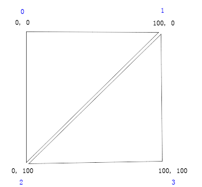
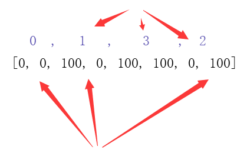
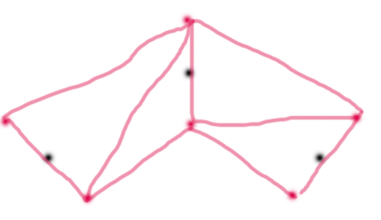
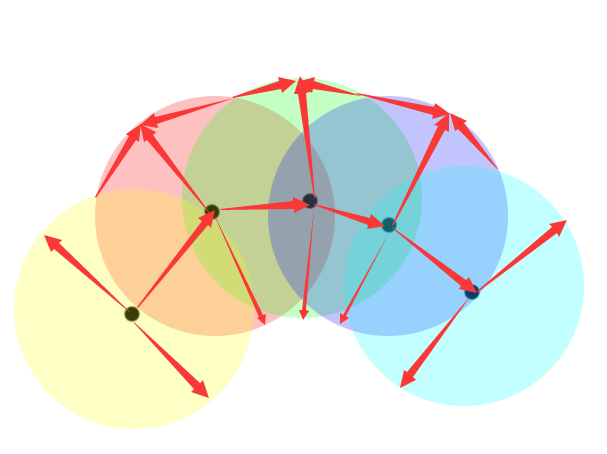
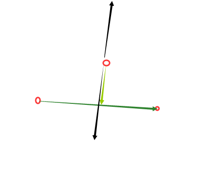
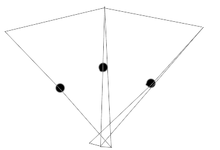
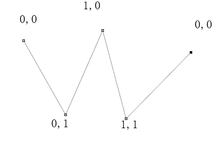
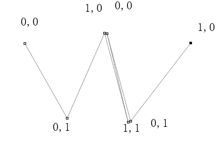

好久没写博文，今天打卡。
主题关于 canvas 虚线的绘制，或者说是一定路径的无限循环贴图的绘制，比如龙、蛇的身体绘制等等，网上都没有相关的实现，外国论坛也没有，所以索性就总结一下难点重点。

这里是围绕 PIXI 的接口来实现。

首先是准备的有：

1. 一条线的一组点
2. 要进行无限循环的贴图

实现需要基于[PIXI.mesh.Mesh](https://pixijs.github.io/docs/PIXI.mesh.Mesh.html)这个类来实现。
需要传入的参数有：texture, vertices, uvs, indices。（drawMode 使用原本默认即可）

- texture 贴图对象 PIXI.Texutre
- vertices 顶点对象 Float32Array，默认是[0, 0, 100, 0, 100, 100, 0, 100]
- uvs 顶点贴图信息 Float32Array，0~1，代表贴图两个边缘，默认是[0, 0, 1, 0, 1, 1, 0, 1]
- indices 顶点顺序 Uint16Array，默认是[0，1，3，2]，代表一个长方形的绘制，那么会被绘制成两个三角形，分别是 0,1,2 和 1,3,2 。而这里的顶点顺序则拿去代表 vertices 数据的顺序，简单用程序表示那就是：`indices.map((v,i)=>[ indices[i],indices[i+1],indices[i+2] ])`，有这个数据我们通常用来把重复点的数据合并成一个重复使用。

## vertices 的获取

看这样一张图来说明 vertices, indices 这两个变量的默认值：



如图，首先把 vertices 的数据中的顶点 4 个坐标点出，每两个数据为一组数据点 x,y，这里一共四个点。
然后这四个点如何连成三角形？上面提到点的顺序必须是 0,1,2 然后 1,2,3。如果还有更多，那就是 2,3,4，如此下去，就形成三角网状结构。而 indices 参数就是用来指出这四个点的顺序。默认是[0，1，3，2]，那么就得到一下顺序：



而 uvs，则是指出这个点在贴图中的百分比，和 vertices 一样，没两个数据为一组数据点 x,y。

所以根据这个规律，来实现贴图的无限循环。
为了简单，我们这里将 indices 直接定为 0,1,2,3,4,5,6,7,8.....
接下来会涉及到大量算法代码，我不贴出代码了，就说一下重点难点的思路：
其中最重要的是线段加粗算法，比如下图的三个点所组成的线段：



我们 可以很直接的得出这样的贴图顶点。
这里推荐一种思路：点画圆：



如图，除了首位两个点是取与相邻点的法线与圆的交点外，其余的点，取法如图所示，直接取两圆交点所在弧 间点，化成数学就是这样的算法：左右两点的法线所在线上取两点，这两点与中间点的距离相等



> 不过我有一个不是很理解的问题，就是贴图交织的问题，不知道如何解决：如果遇到这种情况呢？
>
> 
>
> 图片估计看得很奇怪，奇怪就够了，因为贴图已经不是按照我想要的交织在一起，因为蛇、龙的身体在扭曲后，并不是后面的贴图把前面的覆盖了，而是把扭曲的部分合并在一起了。这里的问题就是这条线加粗后，如何正确的取到它两边的点。

## uvs 的获取

说完 vertices 这个变量的取值方法，还有一个难点就是 uvs 的问题，uvs 取值 0~1，如何是我们需求提到的虚线、蛇、龙等，那么 y 方向的都是 0，1 即可。x 方向就变成要根据点与点的距离来手动计算了。
要注意的是如果在从 0 递增到 1 后，接下来，要进行一次反转，然后才能从 0 再重新开始，如下面图：



如果不进行反转，那么就会发生 1,0 | 1,1 | 0,0 三个点画了一个三角形，这个三角形明显就是贴图镜像效果，如何避免，我们可以在 1,0 | 1,1 这两个点的坐标上面直接加上 0,0 | 1,0。效果就等于在看不到的地方直接进行了反转，避免镜像贴图的出现，如图：（PS：这里的重复点可以用 indices 来实现）



还有一个问题就是补点的问题，两点之间的距离不一定，我们要保持贴图的比例，就要确保两 uvs 的值要和两点之间的距离来确定。当 uvs 累计到>=1 的时候，就要在 uvs 为 1 的地方补点。如何实现我就不赘述了，实现不难。
我这里讲一个另外一种脏方法，可以免去补点的问题。就是用 svg 的 path 对象，我们将线绘制到 path 对象上后调用接口就是 getPointAtLength(number)。贴图宽高知道的情况下，可以获取指定长度来取到对应的点的坐标。这样就免去补点的麻烦了。

> ## 实现线的光滑
>
> 既然用到了 svg，这里顺便贴出点光滑的实现代码：
>
> ```js
> function getAnchors(p1x, p1y, p2x, p2y, p3x, p3y) {
>   var is_turn = 1;
>   if (p3x < p1x) {
>     is_turn = -1;
>   }
>   var l1 = (p2x - p1x) / 2,
>     l2 = (p3x - p2x) / 2,
>     a = Math.atan((p2x - p1x) / Math.abs(p2y - p1y)),
>     b = Math.atan((p3x - p2x) / Math.abs(p2y - p3y));
>   a = p1y < p2y ? Math.PI - a : a;
>   b = p3y < p2y ? Math.PI - b : b;
>   var alpha = Math.PI / 2 - ((a + b) % (Math.PI * 2)) / 2,
>     dx1 = l1 * Math.sin(alpha + a),
>     dy1 = l1 * Math.cos(alpha + a),
>     dx2 = l2 * Math.sin(alpha + b),
>     dy2 = l2 * Math.cos(alpha + b);
>   return {
>     x1: p2x - dx1 * is_turn,
>     y1: p2y + dy1 * is_turn,
>     x2: p2x + dx2 * is_turn,
>     y2: p2y + dy2 * is_turn,
>   };
> }
> var pathNode = document.createElementNS("http://www.w3.org/2000/svg", "path");
> pathNode.setAttribute(
>   "d",
>   points
>     .map((point, i) => {
>       if (i === 0) {
>         return (
>           "M " + point.x + " " + point.y + "C " + point.x + " " + point.y
>         );
>       } else if (i < points.length - 1) {
>         var pre_point = points[i - 1];
>         var nex_point = points[i + 1];
>         var a = getAnchors(
>           pre_point.x,
>           pre_point.y,
>           point.x,
>           point.y,
>           nex_point.x,
>           nex_point.y
>         );
>         return (
>           a.x1 +
>           " " +
>           a.y1 +
>           " " +
>           point.x +
>           " " +
>           point.y +
>           " " +
>           a.x2 +
>           " " +
>           a.y2
>         );
>       } else {
>         //最后一个点
>         return point.x + " " + point.y + " " + point.x + " " + point.y;
>       }
>     })
>     .join(" ")
> );
> ```
