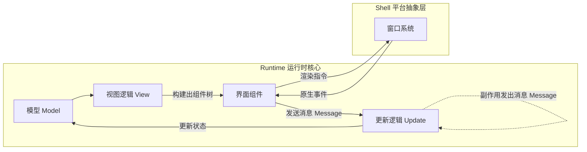
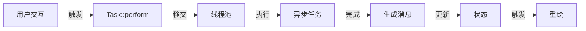

> 参考资料:
>
> - [Building a simple text editor with iced, a cross-platform GUI library for Rust](https://www.youtube.com/watch?v=gcBJ7cPSALo)
>   视频的内容是老旧的，但本文写在 2025 年 3 月，已经参考最新版的示例代码和相关文档，做出适配。
> - [editor/main.rs](https://github.com/iced-rs/iced/blob/9c1edc3/examples/editor/src/main.rs)
> - [Frequently Asked Questions](https://github.com/iced-rs/book/blob/1176472/src/faq.md)
> - [Architecture](https://github.com/iced-rs/book/blob/1176472/src/architecture.md)
> - [First Steps](https://github.com/iced-rs/book/blob/1176472/src/first-steps.md)
>
> <com-youtube-player videoId="gcBJ7cPSALo" />

## 1. 架构总览：消息驱动的响应式系统

Iced 的核心架构启发于经典的 Elm 架构（The Elm Architecture）。
通过对界面系统的本质分析，我们可以识别出四个核心组件及其职责：

- **模型（Model）**：应用程序的状态
- **消息（Message）**：应用程序的交互（包含用户交互、系统事件、动画事件、组件之间通讯 等信号）
- **更新逻辑（Update logic）**：定义着消息如何改变状态
- **视图逻辑（View logic）**：定义着状态如何构建出组件树（官方称为 widgets）

> 此外，不同的平台，通过抽象层（Shell）处理跨平台的窗口系统集成。

这种架构建立了一个严格的**单向数据流**，这种模式使得状态变更可预测、可追踪。

用户与界面组件（Widget）交互产生消息（Message），消息经由更新逻辑（Update）处理并修改应用状态（Model），状态变更触发视图逻辑（View）重新构建界面组件。

> 值得注意的是，Iced 中的界面组件（Widget）是通用且可重用的基础设施，它们只负责渲染和事件捕获（没有副作用）。
> 而应用的状态结构、消息类型以及它们之间的转换关系则是特定于业务的。
> 这种分离让开发者能够专注于设计符合业务需求的状态管理逻辑，同时复用框架提供的界面组件能力。

## 2. 异步任务处理与并发模型

> **Q: 异步任务处理会阻塞界面吗？**
>
> Iced 采用了精心设计的任务调度策略：
>
> 1. 同步操作立即更新状态并触发渲染
> 2. 异步操作通过 Task 系统移交运行时处理
> 3. 异步任务的执行不会阻塞其他组件的更新和交互
> 4. 长时间任务会被移交到独立线程池，确保 UI 响应性

> **Q: Task 系统如何处理异步状态反馈？**
>
> Task 系统提供了完整的状态管理机制：
>
> 1. 异步任务启动时可以立即更新组件状态（如显示加载中）
> 2. 任务执行过程中可以通过消息系统反馈进度
> 3. 任务完成后通过消息触发状态更新和界面刷新
> 4. 支持任务取消和错误处理

典型的异步任务处理流程：

> **Q: 组件间如何进行状态同步？**
>
> 组件通信完全基于消息机制：
>
> 1. 组件通过消息表达状态变更意图
> 2. 消息经由调度器统一分发处理
> 3. 状态更新后触发相关组件重绘
> 4. 异步任务状态通过 Task 反馈

> **Q: 长时间异步任务会阻塞界面吗？**
>
> 通过任务调度器的分级策略：
>
> - I/O 密集型：移交线程池
> - UI 密集型：主线程优先
> - 定时任务：时间切片处理

> **Q: Task 系统支持哪些任务类型？**
>
> Task 系统提供了一套完整的任务处理能力，主要分为以下几类：
>
> 1. 基础任务类型
>
>    - none：创建一个无操作的任务，用于表示不需要执行任何异步任务的情况
>    - done：创建一个立即完成的任务，直接产生给定值
>    - perform：执行一个异步 Future 并映射其输出，支持错误处理
>    - run：执行一个 Stream 并映射每个输出项
>    - sip：执行一个 Sipper 任务，支持进度反馈和最终输出的映射
>
> 2. 任务组合类型
>
>    - batch：将多个任务组合成一个并行执行的任务
>    - map：映射任务的输出值，不改变任务执行流程
>    - then：串行执行任务，支持基于前一个任务的输出动态创建新任务
>    - chain：串联两个任务，第二个任务在第一个任务完全结束后执行
>    - collect：收集任务产生的所有输出到一个 Vec 中
>    - discard：丢弃任务的输出，只保留副作用
>
> 3. 特殊任务类型
>    - future：直接从 Future 创建任务
>    - stream：直接从 Stream 创建任务
>    - abortable：创建可中断的任务，返回任务和控制句柄
>    - widget：执行界面组件操作并产生输出
>    - effect：执行一个不产生输出的 Action
>
> 这些任务类型支持灵活组合，例如：
>
> - 可以用 then 串联多个异步操作，处理复杂的业务流程
> - 可以用 batch 并行执行多个独立任务提高效率
> - 可以用 sip 处理带进度反馈的长时间操作
> - 可以用 abortable 实现可取消的操作，提升用户体验
>
> Task 系统通过这些组合能力，让开发者能够优雅地处理各类异步场景，同时保持代码的可维护性。

这种设计确保了：

1. 组件间解耦，仅通过消息接口交互
2. 状态变更可追踪，便于调试
3. 异步操作不会阻塞 UI 响应
4. 组件可以感知其他组件的处理状态
