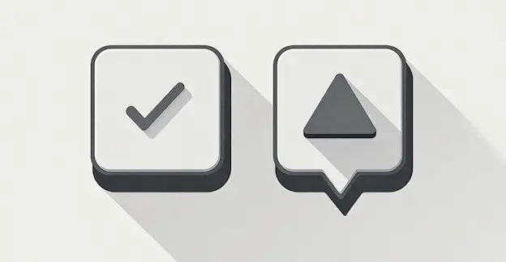
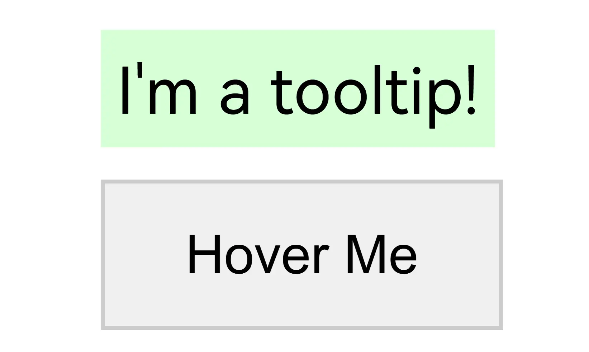
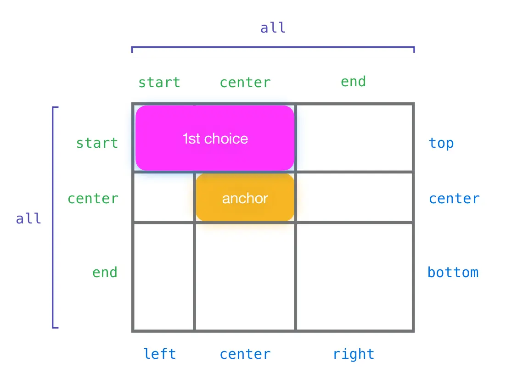

今天我们要聊一个 CSS 世界里正在悄然兴起，但可能彻底改变我们布局方式的“大杀器”——**CSS Anchor Positioning**（锚定定位）。

你有没有遇到过这样的场景？鼠标悬浮在一个按钮上，想弹出一个 tooltip；点击一个输入框，希望下方出现一个建议列表；或者实现一个下拉菜单，它得不偏不倚地对齐触发按钮。



在过去，我们是怎么解决的？

1.  **DOM 结构依赖：** 把 tooltip/下拉菜单硬塞到按钮的父元素里，然后用 `position: relative/absolute` 各种计算。但这要求 DOM 结构必须“配合”，不够灵活。
2.  **JavaScript 大法：** 获取按钮的位置和尺寸 (`getBoundingClientRect`)，计算 tooltip 应该放哪，监听滚动、窗口大小变化，重新计算... 心智负担重，性能还可能有问题。这感觉就像是为了拧个螺丝，结果造了台挖掘机。

这些方法都透露着一种“不得已而为之”的无奈。我们只是想让一个元素 _相对_ 于 _另一个_ 元素定位，为什么就这么难？CSS 的 `position: absolute` 不是相对于包含块吗？如果我的触发元素和定位元素不在一个合适的包含块里，或者我压根不想关心它们的 DOM 结构关系呢？

**Anchor Positioning 的核心哲学：解放定位，打破束缚**

CSS Anchor Positioning 就像给 CSS 定位系统加了个“外挂”。它的核心思想简单粗暴但极其有效：

> **让一个元素（通常是绝对定位或固定定位的）可以显式地声明它想“锚定”到页面上的一个或多个其他元素，并基于这些“锚点”元素的位置和尺寸来定位或调整自身尺寸，而无需关心它们在 DOM 树中的关系或共同的包含块。**

这就像在大海里航行，以前你只能靠附近的灯塔（包含块）定位，现在你可以直接抛锚（anchor）到任何你想停靠的岛屿（任意元素）旁边。这种**解耦**是革命性的：

- **DOM 结构自由：** 你的 tooltip、popover 可以放在 `<body>` 下，或者任何你想放的地方，不再受父子关系的限制。
- **CSS 驱动：** 定位逻辑回归 CSS，减少甚至消除对 JS 的依赖，更符合关注点分离原则，性能也可能更好。
- **智能避让：** 内建了处理边缘碰撞、自动调整位置（fallback）的机制，让“气泡总在元素旁边，但又不会跑出屏幕”这种需求变得简单。

听起来是不是很激动人心？别急，我们一步步来看它是怎么施展魔法的。

### 入门：抛出第一个锚

想象我们要给一个按钮 `.anchor-btn` 加一个 tooltip `.tooltip`。

**第一步：指定谁是锚点 (`anchor-name`)**

首先，得告诉 CSS，哪个元素是我们的“锚”。这通过 `anchor-name` 属性完成。它的值需要是 CSS 变量那种 `--` 开头的“虚线标识符”（dashed-ident）。

```css
.anchor-btn {
  /* --my-anchor 就是这个锚点的名字 */
  anchor-name: --my-anchor;

  /* 其他样式... */
  padding: 10px 20px;
  border: 1px solid #ccc;
}
```

**第二步：设置需要定位的元素**

Tooltip 通常需要脱离文档流，所以我们给它 `position: fixed` 或 `absolute`。`fixed` 更省心，不用担心嵌套层级和 `transform` 干扰定位基准（虽然 Anchor Positioning 自身对 transform 和 scroll 有特殊处理，后面会提）。

```css
.tooltip {
  position: fixed; /* 或者 absolute */
  background-color: #333;
  color: white;
  padding: 5px 10px;
  border-radius: 4px;
  /* 先隐藏，可能通过 JS 或 :hover/:focus 等显示 */
  display: none;
}
```

**第三步：连接锚点和定位元素 (默认锚点 `position-anchor`)**

现在，告诉 `.tooltip`，它默认应该参考哪个锚点。使用 `position-anchor` 属性。

```css
.tooltip {
  position: fixed;
  /* ... 其他样式 ... */

  /* 默认情况下，我的位置参考 --my-anchor 这个锚点 */
  position-anchor: --my-anchor;
}
```

**第四步：使用 `anchor()` 函数定位**

最关键的一步来了！怎么具体定位呢？用 `anchor()` 函数！这个函数可以用在 `top`, `left`, `right`, `bottom` 这些 inset 属性里。

`anchor()` 函数的基本用法是 `anchor(<anchor-side>)`。当 `position-anchor` 设置了默认锚点时，可以省略锚点名字。`<anchor-side>` 指的是你希望定位元素的哪条边对齐锚点元素的哪条边。

例如，我们想让 tooltip 的底部（`bottom`）对齐按钮的顶部（`top`）：

```css
.tooltip {
  position: fixed;
  /* 消除默认 margin 行为，这个很重要，否则会有很多不符合预期的行为 */
  margin: 0;
  /* 设置锚定点 */
  position-anchor: --my-anchor;
  /* ... 其他样式 ... */

  /* 让我的 bottom 对齐 默认锚点 的 top */
  bottom: anchor(top);
  /* 水平方向，让我的左边 对齐 默认锚点 的左边 */
  left: anchor(left);

  /* 加一点偏移，让 tooltip 在按钮上方一点 */
  margin-bottom: 8px;
}
```

`anchor()` 函数里的 `top`, `left`, `right`, `bottom` 指的是锚点元素的**边界**。

还有两个特殊的关键字：`inside` 和 `outside`。
`inside` 指的是与 inset 属性**相同**的边，`outside` 指的是**相对**的边。

例如，`bottom: anchor(top)` 可以理解为：
我要设置 `bottom` 属性，它的值依赖于锚点的 `top` 边。

而 `bottom: anchor(outside)` 就有点意思了，用在 `bottom` 属性上时，`outside` 指的是锚点的 `top` 边。用在 `top` 属性上时，`outside` 指的是锚点的 `bottom` 边。它表示“贴着锚点的外面”。

所以，上面的 `bottom: anchor(top)` 其实更自然的写法是：

```css
.tooltip {
  /* ... */
  /* 把我的 top 定位在 锚点 的 bottom (即按钮下方) */
  /* top: anchor(bottom); */

  /* 或者，让我的 bottom 定位在 锚点 的 top (即按钮上方) */
  bottom: anchor(top);

  /* 水平居中？可以让 tooltip 的中线对齐锚点的中线 */
  left: anchor(center);
  transform: translateX(-50%); /* CSS经典居中 */

  margin-bottom: 8px; /* 向上偏移 */
}
```

`anchor()` 还可以接受百分比，`anchor(50%)` 或 `anchor(center)` 都代表锚点对应轴向的中心线。

```html
<button class="anchor-btn">Hover Me</button>
<div class="tooltip" style="display: block;">I'm a tooltip!</div>
```



是不是很简单？没有 JS，没有复杂的 DOM 嵌套，CSS 自己搞定了！

### 进阶：让定位更得心应手

`anchor()` 函数很强大，但每次都要写 `top`/`left` 有点繁琐。Anchor Positioning 提供了一些“语法糖”和增强功能。

**1. `position-area`：九宫格布局**

这是个超级方便的属性。它把锚点元素和它的“可用空间”（通常是视口或其包含块）想象成一个 3x3 的网格。你可以直接指定 tooltip 应该占据哪个格子。

 (来自规范草案的图)

它的值可以是类似 `block-start`（块轴起点，通常是顶部）, `inline-end`（行轴终点，通常是右侧）, `center` 这样的关键字组合。

例如，把 tooltip 放在按钮上方居中，可以这样写：

```css
.tooltip {
  position: fixed;
  position-anchor: --my-anchor;
  /* ... 其他样式 ... */

  /* 区域：块轴起点(top)，行轴中间(center) */
  position-area: block-start center;
  /* 默认对齐方式通常就不错，也可以用 align-self/justify-self 微调 */
}
```

想放右边中间？`position-area: center inline-end;`
想放左下角？`position-area: block-end inline-start;`

它甚至支持跨越多行/列，如 `span-block-start` (从中间跨越到顶部)。

**2. `anchor-center`：居中对齐的新选择**

对于 `align-self` 和 `justify-self`，增加了一个新值 `anchor-center`。当使用 `position-area` 或希望在某个轴向上精确地对齐锚点的中心时，这个值非常有用。

```css
.tooltip {
  /* ... */
  position-area: block-start; /* 放在上方区域 */
  justify-self: anchor-center; /* 水平方向对齐锚点中心 */
}
```

**3. `anchor-size()`：尺寸向锚点看齐**

有时候，我们希望定位元素的尺寸能跟随锚点变化。比如，下拉菜单的宽度应该和触发按钮一样宽。`anchor-size()` 函数应运而生！

```css
.dropdown-menu {
  position: fixed;
  position-anchor: --my-trigger;
  /* ... */
  top: anchor(bottom);
  left: anchor(left);

  /* 让我的宽度等于 --my-trigger 锚点的宽度 */
  width: anchor-size(width);
  /* 或者用逻辑轴 */
  /* width: anchor-size(inline); */

  /* 高度也可以 */
  /* max-height: anchor-size(height) * 3; */
}
```

`anchor-size()` 可以用在 `width`, `height`, `min-*`, `max-*` 等属性中，可以引用 `width`, `height`, `block`, `inline` (逻辑轴) 等。

### 实战：处理真实世界的复杂性

理想很丰满，现实很骨感。如果 tooltip 放在按钮上方会超出屏幕怎么办？如果滚动页面，锚点跑了，tooltip 会不会留在原地发呆？

**1. 边缘碰撞与回退 (`position-try-fallbacks`, `@position-try`)**

这是 Anchor Positioning 的精髓之一！当默认的定位方式导致元素溢出其容器（通常是视口）时，它可以自动尝试备选方案。

- **内置回退策略 (`flip-block`, `flip-inline`, `flip-start`)**:
  `position-try-fallbacks` 属性可以接受一些关键字，比如 `flip-block` 会尝试在块轴方向翻转（比如从上翻到下），`flip-inline` 则在行轴方向翻转（从左到右）。

  ```css
  .tooltip {
    /* ... */
    position-area: block-start; /* 默认放上面 */
    /* 如果上面放不下，尝试块级翻转（放到下面） */
    position-try-fallbacks: flip-block;
  }
  ```

- **自定义回退规则 (`@position-try`)**:
  你可以定义具名的回退样式集。

  ```css
  @position-try --fallback-bottom {
    position-area: block-end; /* 尝试放下面 */
    /* 可以定义更多样式调整 */
    background-color: lightcoral; /* 比如换个背景色提示 */
  }

  @position-try --fallback-right {
    position-area: inline-end;
  }

  .tooltip {
    /* ... */
    position-area: block-start; /* 默认放上面 */
    /* 尝试顺序：先用 --fallback-bottom 规则，再尝试行内翻转，再用 --fallback-right 规则 */
    position-try-fallbacks: --fallback-bottom, flip-inline, --fallback-right;
  }
  ```

- **回退顺序 (`position-try-order`)**:
  默认按 `position-try-fallbacks` 列表顺序尝试。但有时你希望优先选择**空间更大**的回退位置，可以用 `most-width`, `most-height`, `most-block-size`, `most-inline-size`。

  ```css
  .tooltip {
    /* ... */
    position-try-fallbacks: --try-top, --try-bottom, --try-left, --try-right;
    /* 优先选择高度最大的位置 */
    position-try-order: most-height;
  }
  ```

**2. 滚动与变换：性能与行为的权衡**

这是一个复杂但重要的话题。如果锚点在可滚动区域内，或者被 `transform` 了，定位元素怎么办？

- **基本原则：** 为了性能，浏览器通常**不会**在滚动或 `transform` 改变时频繁重新计算锚点元素的精确布局。
- **记住滚动偏移 (`remembered scroll offset`)：** 浏览器会在某个时间点（比如元素首次显示或回退策略改变时）“记住”锚点相对于定位元素的滚动容器的滚动偏移量。后续定位会基于这个记住的值。
- **默认锚点的特权：** 如果定位元素只依赖**默认锚点** (`position-anchor` 指定的那个)，并且满足特定条件（比如用了 `anchor-center` 或 `position-area`），浏览器**可以**在滚动时**平移**定位元素，让它跟随默认锚点移动。这是一种性能友好的“补偿”(`compensate for scroll`)。
- **多锚点或非默认锚点：** 如果你用了多个 `anchor()` 指向不同滚动容器的锚点，或者依赖非默认锚点，滚动时它们的位置可能就不再精确跟随了（只跟随非滚动部分的移动）。
- **`transform` 的影响：** 规范草案目前提到，默认情况下，锚点上的 `transform` **不影响** `anchor()` 函数的计算结果（Issue 1）。这可能会在未来改变。

简单说：尽量让你的主要定位逻辑依赖默认锚点，可以获得更好的滚动跟随效果。对于复杂的多锚点场景，滚动时的行为可能没那么“实时”。

**3. 条件隐藏 (`position-visibility`)**

有时候，如果锚点无效、不可见，或者即使尝试了所有回退方案，定位元素仍然溢出，我们可能希望直接隐藏它。`position-visibility` 属性就是干这个的。

```css
.tooltip {
  /* ... */
  /* 默认值是 anchors-visible，如果锚点不可见（比如被滚动隐藏了）就自动隐藏 */
  /* position-visibility: anchors-visible; */

  /* 如果所有回退都试过后还溢出，就隐藏 */
  position-visibility: no-overflow;

  /* 如果有必须的锚点（比如 anchor() 没提供 fallback 值）无效，就隐藏 */
  /* position-visibility: anchors-valid; */

  /* 组合使用 */
  position-visibility: anchors-valid no-overflow;
}
```

### 高级话题：作用域、隐式锚点

- **`anchor-scope`：避免命名冲突**
  在组件化开发中，如果你在列表的每个 `<li>` 里都用了 `anchor-name: --item-anchor`，那所有 `<li>` 里的定位元素都会锚定到**最后一个** `<li>` 上！`anchor-scope` 可以限制锚点名称的查找范围。

  ```css
  li {
    /* 这个锚点名字只在 li 内部及其后代中有效 */
    anchor-name: --item-anchor;
    anchor-scope: --item-anchor;
    position: relative; /* 创建层叠上下文可能也有帮助 */
  }
  li .popup {
    position: absolute;
    position-anchor: --item-anchor;
    top: anchor(bottom);
    /* ... */
  }
  ```

- **隐式锚点 (`auto`)**
  某些 HTML API（比如未来的 Popover API）可能会自动建立锚定关系。比如，触发 popover 的按钮自动成为该 popover 的“隐式锚点”。这时，你可以用 `position-anchor: auto;` 或者在 `anchor()`/`anchor-size()` 中省略锚点名来引用它。

### 别忘了可访问性 (Accessibility)

重要的事情说三遍：Anchor Positioning 是**纯视觉**的！它在视觉上把两个元素关联起来，但**不会**自动建立它们之间的语义联系。

屏幕阅读器等辅助技术无法理解这种视觉关联。所以，你必须：

- 使用 `aria-describedby`, `aria-details` 等 ARIA 属性，在 HTML 中明确两者关系。
- 确保合理的焦点管理和键盘导航。

好消息是，像 Popover API 这样的原生 HTML 功能，在提供隐式锚点的同时，通常也会处理好相关的可访问性问题。

### 总结：未来已来？

CSS Anchor Positioning 无疑是近年来 CSS 布局领域最激动人心的提案之一。它直击了 Web 开发中长期存在的定位痛点，提供了一种更声明式、更灵活、更强大的解决方案。

**优点：**

- **DOM 解耦：** 布局不再受限于 HTML 结构。
- **CSS 驱动：** 减少 JS 依赖，代码更清晰。
- **智能回退：** 内建边缘检测和位置调整。
- **强大灵活：** `anchor()`, `anchor-size()`, `position-area` 提供了丰富的控制。

**注意事项/挑战：**

- **新规范：** 目前仍是 Editor's Draft（编辑草案），API 可能会变化，浏览器支持需要关注（通常需要开启实验性标志）。(写作时基于 2024 年 10 月草案)
- **滚动/变换行为：** 涉及性能权衡，行为需要理解清楚。
- **可访问性：** 需要开发者额外关注。
- **学习曲线：** 虽然入门简单，但回退、滚动等机制需要深入理解。

总的来说，Anchor Positioning 描绘了一个美好的未来：开发者可以更专注于内容和语义，把复杂的定位逻辑交还给 CSS。虽然离全面普及还有距离，但了解它、尝试它，绝对能让你在未来的 Web 布局中占得先机。

告别那些为了定位而写的 JS "屎山"吧，拥抱 CSS 的新可能！你觉得这个新特性怎么样？欢迎在评论区留下你的看法！

---

希望这篇模仿张鑫旭老师风格的文章能帮助你理解 CSS Anchor Positioning！记得，实际运用时一定要查阅最新的规范文档和浏览器兼容性信息。

参考文献：

1. [CSS Anchor Positioning - Editor’s Draft, 12 October 2024](https://drafts.csswg.org/css-anchor-position-1/)
